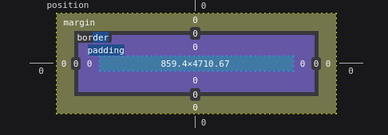

# CMPT 304 SHEEEET -- Jonah Watts & Judah Starkey

---

#### HTML

Default structure of html (Shamelessley stolen from w3)

```html
<!DOCTYPE>
<html>
    <head>
        <title> Page Title </title> <!-- Comment -->
        <link href = "dancingpieman.css" type = "text/css" rel = "stylesheet"> <!--Links the css sheet-->
        <script type="text/Javascript" src="dancingpieman.js" defer></script>  <!--Preloads and links the JS-->
    </head>
    <body>
        <h1> This is a header </h1>
        <p> This is a paragrph </p>
        <a href = "/index" target="_blank"> <!-- Link open in new page -->
    </body>
</html>
```

-   Table row `<tr>` Table Header `<th>` Table collum(data) `<td>`
-   Ordered list: and unordered list
-   Radio Selectors + buttons

---

#### CSS

-   Class `.class`
-   Defualt Property `html` or `h1`
-   ID selector `#id`
-   On Hover Property `#front:hover` or `.tag:active`

Some Basic Selectors


```css
.footer {
	color: rgb (225, 224, 224);
	padding: 10px 10% 10in 50px;
	text-align: center;
	left: 10px; /*Use in the pacman lab to move pacman*/
  position: static;/*default which is not affected by the positioning modifiers*/
  position: relative;/*reletive to every other object*/
  position: fixed;/*on the exact screen coordinates*/
  position: absolute; /*move with other things but to page coordinates*/
  
}
```

---

#### Java Script

```js
el.addEventListener('click', clickOccured, false); //

var tbl = document.querySelector('table#myTable');  // Find table in document
var rw = document.createElement('tr'); //Creates a table row
table.appendChild(rw); //appends to doc
window.setInterval(startMotion,100); //starts interval with function startMotion and time of 100ms
function changeImage(thing) // Example of function header
```

-   arrays

-   operators ==, ===

---

#### Jquery

The jQuery syntax is tailor-made for selecting HTML elements and performing some action on the element(s).

Basic syntax is:

-   `$(selector).action()`

-   A `$` sign to define/access jQuery

-   A `(selector)` to "query (or find)" HTML elements

-   A jQuery `action()` to be performed on the element(s)
    Examples:

-   `.append()`for after the paragraph, `.prepend()`

-   `.remove()`remove everything from the selected jquery

Including jquery in project (incuding from google may be advantagous because it might be allready cashed on the users system)

```js
<head>
	<script src="https://ajax.googleapis.com/ajax/libs.jquery....."></script>
</head>
```

```js
$(this).hide(); // hides the current element.
$("p").hide(); // hides all <p> elements.
$(".test").hide(); // hides all elements with class="test".
$("#test").hide(); // hides the element with id="test".

$el.fadeOut(500).fadeIn(100); //Causes the element to flash once

$(document).ready(function () {
	// Hides an elemetn when a user clicks on teh button
	$("button").click(function () {
		$(".test").hide(); // Change with .test or p
	});
});
```

---

#### PHP

-   GET puts the user input in the URL, while the POST does not
-   HTML special chars prevent malicious code from being run on your website
-   Only the HTML output is visable in the browser

```php
$x = 3.14;
//function that prints the first 10 entries of the array $arr seperated by a comma
for($i=0; $i<10;$i++){
  echo "$arr[$i],";
}

//Query a page in post and get
echo "<a href=\"dictionary.php?searchWord=computing\">computing</a>";


//connect MySQL
$db = new mysqli('localhost', 'root', 'mmljar', 'bookstore');

//Qyery the sql
$query = "SELECT Author, Title FROM books WHERE $searchtype = ?";
$stmt = $db->prepare($query);
$stmt->bind_param('s', $searchterm);
$stmt->execute();
```

---

#### MySQL

Advantageous because multiple people can acces and edit data at once

```sql
  \c --Exit a query using

  CREATE TABLE contacts (Name char(50), Number int(10) unsigned); -- Create a database

  INSERT INTO books VALL --How to add a book to the database

  describe books --Method to show different keys in the table. When inserting duplicate data will show duplicate data in table.
```

Show all of the data from inside of the database

```sql
  SELECT * FROM books
  SELECT title, price FROM books
```

Method to update or delete an entry in a database

```sql
  DELETE FROM books WHERE ISBN = 4;
  SELECT * FROM books WHERE Price <= 19;
```

How to edit an entry from the table

```sql
  UPDATE books SET Title = 'REPLECEMENT' WHERE ISBN = 'xxx-xxx-xxx';
```

How to alter the type iside a table

```sql
  modify collumn Price decimal(6,2);
```

In this example using decimal wrather than a floatng point will lead you to have an exact number wrather than the floating point

-   When inserting into the database, make sure to insert the data in order and to provide quotations around string and none around floats

-   Also when entering a thing above the limit, it trunkates the limit

#### Ajax

-   Uses js to get information from a server to refresh a certain part of the server without refreshing the whole page
